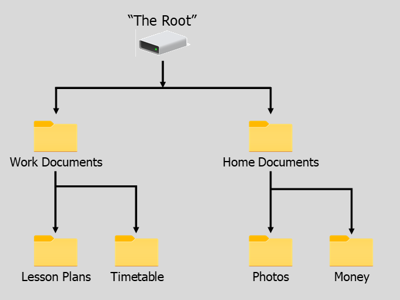

---
permalink: tutorials/files-and-folders/files-and-folders-14.html
layout: article-no-aside
type: article-no-aside
subtitle: Part 7
pageTitle: "Tutorial: Intro to Files & Folders"
title: "Finding Files 5"
css: basic-skills
js: files-and-folders
jsInit: true
--- 

<header>

  <h4>{{ page.subtitle }}</h4>  
  <h1>{{ page.title }}</h1>
          
</header>

<article id="article-body">
          
  <section>
          
    

      
   
      
        

          Find the MP4 file Creating Apps. It is a video tutorial, a resource for a planned course. Where might it be stored?
        

      

      

          

            
            
&#8593;

          
            

            

             

          
  

      

      

        

        
      

                
    

    <!-- Pre-load the icon image -->    
     
     
     
     
     
     
         
    
    

      
<a href="./files-and-folders-13.html">&#8592;&nbsp;Previous Section</a>

      
<a href="./files-and-folders-15.html">Next Section&nbsp;&#8594;</a>

    

  </section> 

</article>     