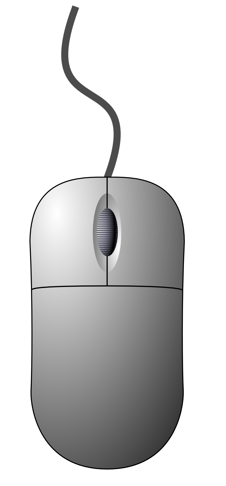
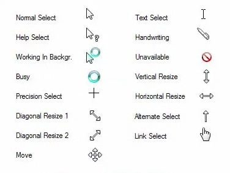

---
permalink: tutorials/mouse/mouse-1.html
layout: article
type: article
subtitle: Part 1
pageTitle: "Tutorial: Using a Mouse"
title: Using a Mouse
css: basic-skills
js: mouse
--- 
<header>

  <h4>{{ page.subtitle }}</h4>  
  <h1>{{ page.title }}</h1>
          
</header>

<article id="article-body">
          
  <section>
          
    <h3>Section</h3>
    <h1>Mouse Buttons</h1>
          
    <h2>What are they?</h2>
          
    

      A mouse usually has three buttons: Left, Right, and Middle (also known as a scroll-wheel). Move your mouse over the image below to find descriptions of each button. When you're comfortable moving the mouse around the diagram, move on.
    

          
    <figure>

      

        
        

      

      <map name="buttons">

        <area shape="rect" coords="39, 230, 123, 375" alt="Left Mouse Button" onmouseover="mouseButtonInfo(true, 0);" onmouseout="mouseButtonInfo(false, 0);" href="#">
        <area shape="rect" coords="124, 230, 163, 375" alt="Middle Mouse Button" onmouseover="mouseButtonInfo(true, 1);" onmouseout="mouseButtonInfo(false, 1);" href="#">
        <area shape="rect" coords="164, 230, 248, 375" alt="Right Mouse Button" onmouseover="mouseButtonInfo(true, 2);" onmouseout="mouseButtonInfo(false, 2);" href="#">

      </map>      

      
Mouse Buttons

    
    </figure>
          
  </section>
        
  <section>
          
    <h3>Section</h3>
    <h1>The Mouse Cursor</h1>
          
    <h2>What is the cursor?</h2>
          
    

      The position of your mouse onscreen is shown with a cursor. The cursor is usually an arrow, but it changes depending on what you are doing. For example, if you move your mouse over the link in a webpage, the cursor will change to a pointing hand.
    

    

      Below are some example mouse cursors. Do you recognise any of them from times you have used a computer? You don't need to remember them, they are just there to give you an idea of what the cursor might change to.
    

    <figure>
            
      

        
      

            
      
Mouse Cursors

          
    </figure>
          
  </section>

<section>
          
    <h3>Section</h3>
    <h1>Interacting with the Mouse</h1>
          
    <h2>What is interaction?</h2>
          
    

      When you interact with something, it means you do something, and something else happens as a result. When you use a mouse to interact with icons or links, the computer will usually do something to indicate what can be done with them. This makes using a computer easier. 
    

    

      A mouse is used to click on things within a computer, but not everything can be clicked on. To indicate which bits can be clicked, the computer will change the colour of those bits when you move your mouse over them. Or they'll display some text, or change the cursor, or do something that says "this can be clicked on".
    

    

      Try moving your mouse over the icons below. Can you see what happens when you do? What is that telling you?
    

    <figure>

      

        

          
          <h6>Google Chrome</h6>
        

        

          
          <h6>Microsoft Word</h6>
        

        

          
          <h6>My Documents</h6>
        

      

      
Interactive Icons

    </figure>

    

      You've just seen one example of how the computer reacts to mouse interaction, but not all responses are the same. Links in webpages, for example, are highlighted by the cursor changing to a pointing hand. One of the most difficult things about learning to use computers is that there are often lots of different results to doing similar things.
    

    

      That said, the more you use computers, the more things begin to make sense. Click on the link below to move onto the next section.
    

    

      
&nbsp;

      
<a href="./mouse-2.html">Next Section&nbsp;&#8594;</a>

    

  
  </section>

</article>     