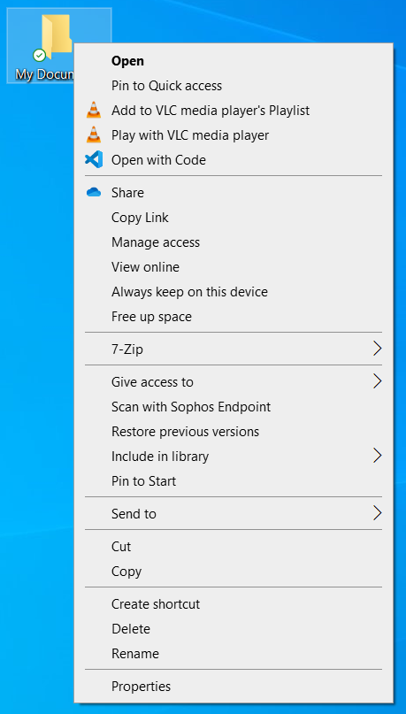
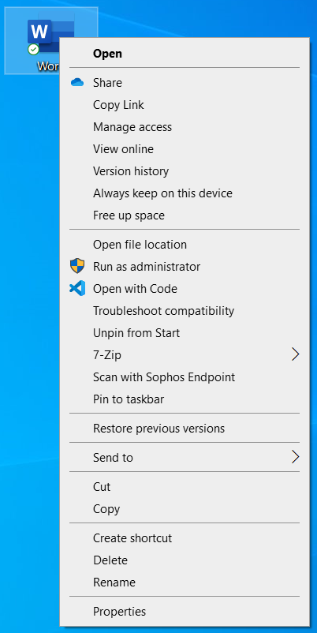
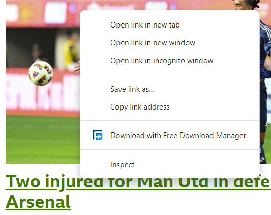
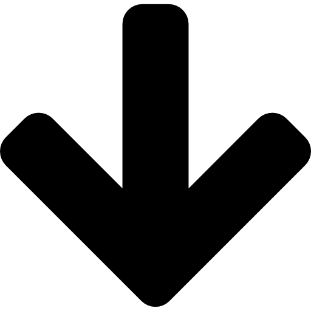

---
permalink: tutorials/mouse/mouse-3.html
layout: article
type: article
subtitle: Part 3
pageTitle: "Tutorial: Using a Mouse"
title: Clicking Buttons, Continued 
css: basic-skills
js: mouse
--- 
<header>

  <h4>{{ page.subtitle }}</h4>  
  <h1>{{ page.title }}</h1>
          
</header>

<article id="article-body">
          
  <section>
          
    <h3>Section</h3>
    <h1>Double Clicking</h1>
          
    <h2>What is double clicking?</h2>
          
    

      A double click is two clicks of the left mouse button, one quite quickly after the other. The trick to double clicking is making sure that you don't move the mouse between clicks. It can take a bit of practice, which is what you're going to do now!
    

    

      When using Microsoft Windows, double clicking on icon will open that file, folder, or application. Try double clicking the icons below. 
    

    <figure>

      

        

          
          <h6>Google Chrome</h6>
        

        

          
          <h6>Microsoft Word</h6>
        

        

          
          <h6>My Documents</h6>
        

      

      

        
        
        

      

      
Double Clicking Icons

    </figure>

    <h2>Practice makes perfect!</h2>
          
    

      As mentioned before, double clicking takes a bit of practice. If you're not comfortable with it yet, try clicking on the boxes below for practice.
    

    <figure>

      

        
0

        
0

        
0

      

      
Double Click Practice

    </figure>          

  </section>
        
  <section>
          
    <h3>Section</h3>
    <h1>Right Clicking</h1>
          
    <h2>What is a Right Click?</h2>
          
    

      Right clicking will usually bring up a menu (a list of things you can do), and those options will normally be related to the item that you right clicked. For example, on a webpage, right clicking a link on will give you the option to open the link; right clicking an image will give you the option to copy or download that image.
    

    

      When a menu is linked to a particular item, it is known as a Context Menu.
    

    

      Below are some examples of context menus, you'll notice that each has different options.
    

    <figure>

      

        
        
        
        
      

      
Context Menus

    </figure>

    

      Try right clicking on the icons below.
    

    <figure>

      

        

          
          <h6>Google Chrome</h6>
        

        

          
          <h6>Microsoft Word</h6>
        

        

          
          <h6>My Documents</h6>
        

      

      

        
        
        

      

      
Selecting Icons

    </figure>

  </section>

  <section>
          
    <h3>Section</h3>
    <h1>Mouse Scrolling</h1>
          
    <h2>What is Scrolling?</h2>
          
    

      Scrolling means to slide pages of content up and down your screen. The content could be a document, or a webpage, or anything else that doesn't fit on a single page.
    

    

      The middle button of a mouse is also known as the scroll wheel and it is used for scrolling through content. To scroll a page up, you roll the middle button away from you, to go down, you roll the button towards you. Practice scrolling the content below until you find the links to continue onto the next section.
    
    

      

        
        
        
        
        

        

          
<a href="./mouse-2.html">&#8592;&nbsp;Previous Section</a>

          
<a href="./mouse-4.html">Next Section&nbsp;&#8594;</a>

        

      

  
  </section>

</article>     