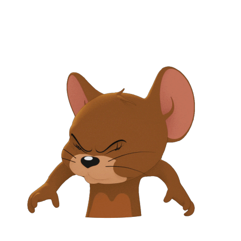

 

  

    Animation is the simulation of movement created by showing several images shown one after the other.
    The simulation might show something realistic, such as a person walking; something fantastic, such as a dragon or spaceship; or something artistic, such as text flying in from the side of the screen.
  

  

    We have all seen some form of animation, such as cartoons.
    In old cartoons, the images were drawn by hand, with each frame needing to be physically created by an artist.
    With the growth of computers and the World Wide Web it has become easier and easier to create animations and they are now used all the time in websites and apps.
  

  
  
An example of animation

