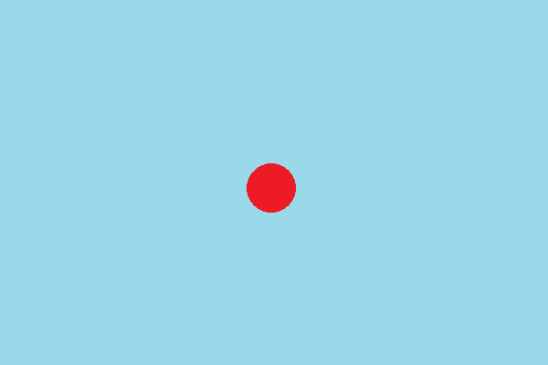

 

  

    Look at the animation below, it is intended to simulate a ball bouncing across the screen.
    To the naked eye, it looks like one continuous video clip, but if you click Next you will see how it is done.
  

  

