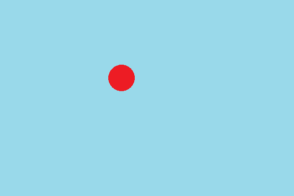
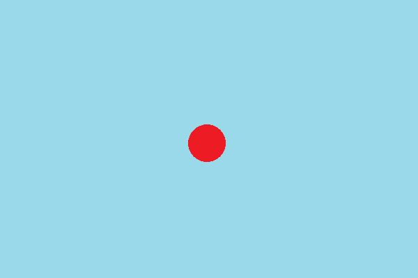
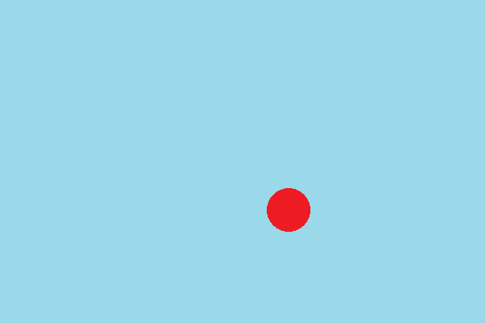

 

  

    The bouncing ball animation is actually made up of twelve individual images.
    You can see the images below; each image is highlighted when it is its specific turn to be displayed.
    A timer controls how often the image changes.
  

  

    The overall effect is to give the illusion of a bouncing ball.
  

  

    

      
      
      
      
      
      
      
      
      
      
      
      
    
    

    

      

    
    

  

